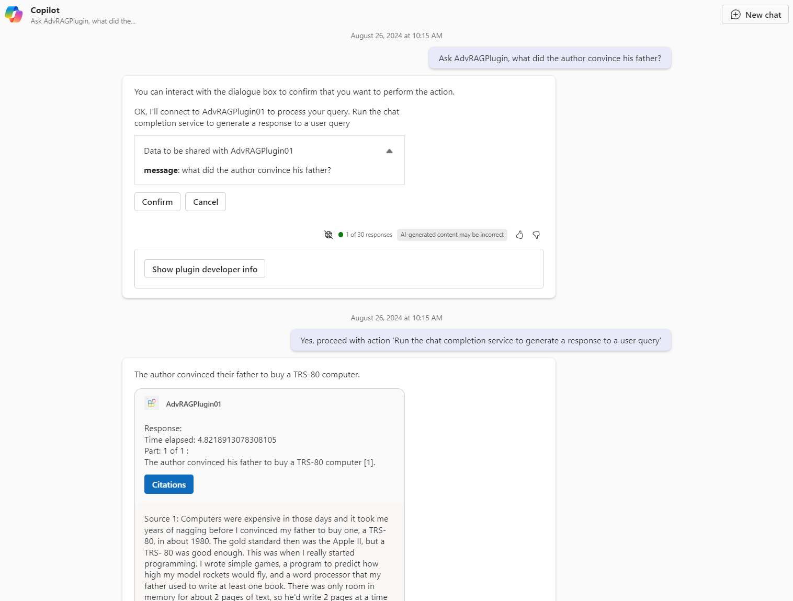

## 09/23/2024 [1.3.5]

Support multi-modal input on Completion API layer

Add Auth middleware on API layer


## 09/03/2024 [1.2.8]

Improve Sub Query Engine for AOAI + Azure AI Search

## 08/27/2024 [1.2.7]

Add real time RAG for Tree Mode Summary and Recursive Retriever.

Add Complete Mode to as real time RAG UI.

Reference content can be doc strings and URL.


## 08/26/2024 [1.2.5]

Accept default parameters for OpenAPI interface, add config in .env.sample

```
Default_Index_Type = 'Knowledge Graph'
Default_Index_Name = 'KGWORK02'
Default_Streaming = 'False'
```

Improve OpenAPI response structure, Copilot OpenAPI Plugin can easily handle it

   /openapi/info/2

   /openapi/info/3

```
{
  "response": "string",
  "citations": [
    "string"
  ]
}
```


## 08/20/2024 [1.2.3]

Add citation features for Azure AI Search, Knowledge Graph, Tree Mode Summary, Recursive Receiver Index. Show indexes in response, show citations source in OpenAPI response.


Show citations in Proofread directly.

OpenAPIs can return citations by default with response.


## 08/16/2024 [1.2.1]

1. Add Swagger 2.0, OpenAPI 3.0 URLs:

   /openapi/info/2

   /openapi/info/3

2. Add OpenAPI API Call: /api/chat

   ```
    {
    "history": [
        [
        [
            "What is the main topic of this article?",
            "The main topic of this article is about the Advanced RAG Service Studio."
        ]
        ]
    ],
    "indexName": "azuresearch_0",
    "indexType": "Azure AI Search",
    "message": "What is the main topic of this article?",
    "streaming": false,
    "systemMessage": "You are a helpful AI assistant. Answer questions clearly with only necessary words and completed sentences."
    }
   ```

3. Add OpenAPI toggle settings in .env.sample

## 08/15/2024 [1.2.0]

1. Add auto-deployment scripts deploy_aoai.sh, deploy_acr_app.sh, and deploy_storage.sh

2. Azure Container App can mount Azure File Share with deploy_storage.sh. This is for scaling out infra in production.

3. Add Default_Storage setting in .env.sample for non temporary storage.

4. Multiple files Index processing for Azure AI Search, Knowledge Graph, Summary, and Recursive Retriever.

5. Index Name can be short index name or full index folder path for Knowledge Graph, Summary, and Recursive Retriever now. 

