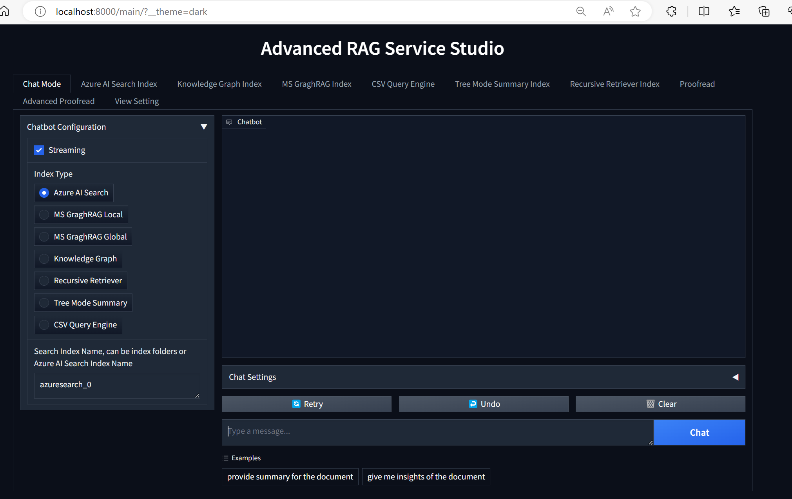
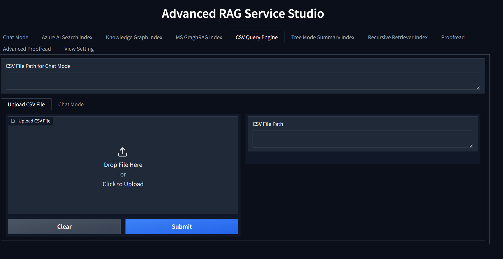
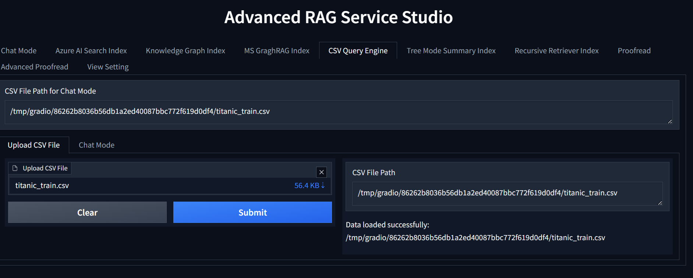
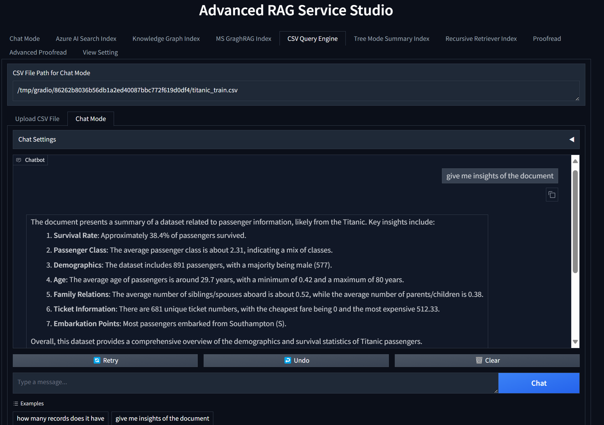
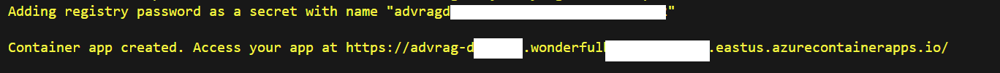

# Step by Step: Integrate Advanced CSV RAG Service with your own data into Copilot Studio

This post is going to explain how to use [Advanced RAG Service](https://techcommunity.microsoft.com/t5/modern-work-app-consult-blog/exploring-the-advanced-rag-retrieval-augmented-generation/ba-p/4197836) easily verify proper RAG tech performance for your own data, and integrate it as a service endpoint into Copilot Studio.

This time we use CSV as a sample. CSV is text structure data, when we use basic RAG to process a multiple pages CSV file as Vector Index and perform similarity search using Nature Language on it, the grounded data is always chunked and hardly make LLM to understand the whole data picture. 

For example, if we have 10,000 rows in a CSV file, when we ask "how many rows does the data contain and what's the mean value of the visits column", usually general semantic search service cannot give exact right answers if it just handles the data as unstructured. We need to use different advanced RAG method to handle the CSV data here.

Thanks to [LLamaIndex Pandas Query Engine](https://docs.llamaindex.ai/en/stable/examples/query_engine/pandas_query_engine/), which provides a good idea of understanding data frame data through natural language way. However to verify its performance among others and integrate to existing Enterprise environment, such as Copilot Studio or other user facing services, it definitely needs AI service developing experience and takes certain learning curve and time efforts from POC to Production.

[Advanced RAG Service](https://techcommunity.microsoft.com/t5/modern-work-app-consult-blog/exploring-the-advanced-rag-retrieval-augmented-generation/ba-p/4197836) supports 6 latest advanced indexing techs including CSV Query Eninge, with it developers can leverage it to shorten development POC stage, and achieve Production purpose. Here is detail step to step guideline:

## POC Stage

### Prerequist

#### Deploy below models in Azure OpenAI Service: 

    gpt-4o mini or gpt-4o

    text-embedding-ada-002

### Create Azure Document Intelligent Service, get its Service URL and Key

### One Docker Environment:

    Windows Docker, WSL2, Debian or Ubuntu

### Setup

a. In Docker environment, run this command to clone the dockerfile and related config sample:

    git clone https://github.com/freistli/AdvancedRAG.git

b. In the AdvancedRAG folder, rename .env.sample to .env

    cd AdvancedRAG
    mv .env.sample .env

c. In the .env file, configure necessary environment variables. In this tutorial, let's configure:

    #Azure OpenAI Setting
    AZURE_OPENAI_API_KEY=
    AZURE_OPENAI_Deployment=gpt-4o-mini
    AZURE_OPENAI_EMBEDDING_Deployment=text-embedding-3-small
    AZURE_OPENAI_ENDPOINT=https://[name].openai.azure.com/

    # Azure Document Intellenigence
    DOC_AI_BASE=https://[name].cognitiveservices.azure.com/
    DOC_AI_KEY=

NOTE: 

    Azure AI Search is not required here because the CSV Query Engine doesn't need it. If you want to try Azure AI Search Index, then configure it.
    

d. Build your own docker image:

    docker build -t dockerimage:tag .

e. Run this docker:

    docker run -p 8000:8000 dockerimage:tag

f. Access http://localhost:8000/    

    Now we can see this service UI

</img>

### Evaluate Respone Quality & Performance

a. Click the **CSV Query Engine** tab, upload a test CSV file, click Submit

</img>

</img>

b. Click the **Chat Mode** tab, now we can use Natural Language to test how good the CSV Query Engine at understanding CSV content:

</img>

### Expose it as a REST API Endpoint

The Advanced RAG Service is built with Gradio and FAST API. It opens necessary [API Endpoints](https://github.com/freistli/AdvancedRAG?tab=readme-ov-file#call-advragsvc-through-rest-api-call) by default. We can turn off any of them in the .env settings.

The Chat endpoint can be used for different index types query/search. Since we are using "CSV Query Engine", now it is:

    POST {{LocalURL}}/advchatbot/run/chat
    content-type: application/json

    {
    "data": [
        "how many records does it have",   
        "", 
        "CSV Query Engine",   
        "/tmp/gradio/86262b8036b56db1a2ed40087bbc772f619d0df4/titanic_train.csv",    
        "You are a friendly AI Assistant" ,
        false   
    ]
    }

The response is:

    {
    "data": [
        "The dataset contains a total of 891 records. If you have any more questions about the data, feel free to ask!",
        null
    ],
    "is_generating": true,
    "duration": 3.148253917694092,
    "average_duration": 3.148253917694092,
    "render_config": null,
    "changed_state_ids": []
    }

 Using this method, we can easily integrate the specific RAG capability to our own service, such as Copilot Studio. Before that, let's publish the service first.

### Publish to Azure

We have different methods to release docker as an app service. Here are the generate steps when we use Azure Contain Registry and Azure Container App. 

a. Create Azure Container Registry resource [ACRNAME], upload your tested docker image to it. The command is:

    az login
    az account set -s [your subscription]
    az acr login -n [ACRNAME]
    docker push [ACRNAME].azurecr.io/dockerimage:tag

b. Create an Azure Container App, deploy this docker image, and deploy it. Don't forget enable Session Affinity for the Container App.

To automate the Azure Container App deployment, I provided [deploy_acr_app.sh](https://github.com/freistli/AdvancedRAG/blob/main/deploy_acr_app.sh) in the repo. 

To use it:

    chmod a+x deploy_acr_azure.sh
    ./deploy_acr_azure.sh [suffix number]

Note: for more details about this sh, can refer to [this guideline](https://learn.microsoft.com/en-us/azure/container-apps/tutorial-code-to-cloud?tabs=bash%2Ccsharp&pivots=acr-remote).

After around 7~8 minutes, the Azure Container App will be ready. You can check the output and access it directly:

</img>

To protect your container app, can follow this guide to enable authentication on it.

[Enable authentication and authorization in Azure Container Apps with Microsoft Entra ID](https://learn.microsoft.com/en-us/azure/container-apps/authentication-entra)

### Integrate into Copilot Studio

